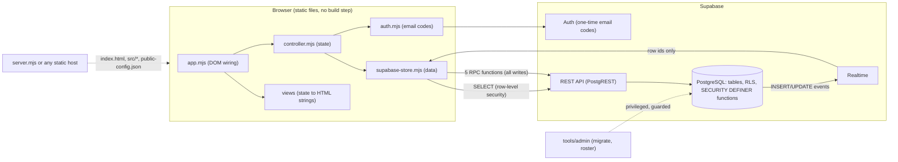

# ViTally developer guide

This guide is for the front-end, back-end and database developers who will turn the ViTally
demonstration into a production system for PCDC's VITA site. It explains how the demo is built,
why it is built that way, which parts are solid foundations and which are demo scaffolding, and
where the remaining work is.

Read this page first, then the guide for your area:

| You work on | Read | It covers |
| --- | --- | --- |
| Everything | [Architecture](architecture.md) | Components, request flow, identity and visibility model, key decisions |
| The database | [Database](database.md) | Schema, row-level security, the action API, the state machine, migrations, recipes |
| The browser app | [Front end](frontend.md) | Module map, controller, rendering, events, Realtime, recipes |
| Server, Auth, tooling, hosting | [Back end and operations](backend.md) | What runs where, configuration, Auth and email, privileged tooling, environments |
| Planning the next phase | [From demo to production](production-roadmap.md) | Gaps against the product spec, demo-only parts to remove, known limitations |

Setup instructions live in one place, [`docs/setup.md`](../setup.md): the Node runtime, the local
Supabase stack, test commands, rehearsal accounts, and the classroom project. This guide links to
it rather than repeating it.

## What ViTally is, in one paragraph

ViTally tracks a tax-return case through a VITA site's workflow: a client applies, the office
checks intake, a volunteer preparer claims the case and requests documents, an office admin
follows up with clients who do not respond, an independent reviewer approves or sends the case
back for corrections, and the reviewer records the follow-up conversation with the client.
Clients and staff work in different browsers on the same shared state, with live updates. The
actual tax preparation happens in external software (TaxSlayer); ViTally records assignments,
requests, milestones and hand-offs. The product requirements are in [`docs/spec.md`](../spec.md);
the demo's own design is in the
[design spec](../superpowers/specs/2026-09-15-vitally-shared-demo-design.md).

## The system in one picture



There is no application server. The browser talks to Supabase directly with the public
(publishable) key. Every read goes through row-level security, and **every write goes through one
of five database functions** that check who may do what, in a fixed order, inside one
transaction. The database is the back end.

## Repository map

```text
index.html                 The only page. Loads src/app.mjs.
server.mjs                 Local static server + /public-config.json (not needed on a static host).
src/
  app.mjs                  Bootstrap and DOM event wiring. No state, no HTML, no queries.
  controller.mjs           All browser state and every user-level operation.
  window-state.mjs         Per-window, per-user navigation memory (sessionStorage).
  supabase-store.mjs       The only data adapter: reads, the 5 RPCs, Realtime, row mapping.
  auth.mjs                 Email one-time-code sign-in, resend cooldown, neutral messages.
  contracts.mjs            Shared vocabulary: stages, actions, checkpoints, error codes.
  errors.mjs               The one mapper from database/transport errors to domain codes.
  domain.mjs               Intake answer keys, required answers, screening, stage wording.
  case-actions.mjs         Builds each action's payload from a button's data and its form.
  views.mjs                Page frame, dialogs, staff screen routing.
  client-views.mjs         Client screens: sign-in, applications, intake form, progress.
  staff-views.mjs          Volunteer work board and case screen; staff eligibility rules.
  admin-views.mjs          Office (admin) board and case screen; admin eligibility rules.
  presenter-views.mjs      Demo-only presenter panel: personas, reset, checkpoints.
  ui.mjs                   HTML helpers, escaping, labels, focus preservation.
  sample-data.mjs          Fictional form filling for demos.
  styles.css               All styles.
  vendor/supabase.mjs      Committed, pinned bundle of @supabase/supabase-js.
supabase/
  migrations/001-009       The whole schema, RLS, and business logic, in order.
  test-stack.config.example.toml   Reference config for the local test stack.
tools/
  admin/                   Privileged tooling: target guards, migrate, roster, workspace setup.
  build.mjs                Rebuilds src/vendor/supabase.mjs.
tests/
  *.test.mjs               Unit tests (no network): 215.
  database*.mjs            Database tests against the local stack: 151.
  auth-browser.mjs         Real sign-in in Chrome and Firefox: 20.
  browser.mjs              The full demonstration story, two browsers, both directions: 51.
  support/                 Test fixtures: throwaway workspaces, browser helpers, cleanup.
docs/
  setup.md                 How to run and test everything.
  demo-script.md           The presentation script.
  spec.md, proposal.md     The product requirements and proposal (the target system).
  superpowers/             The demo's design spec and implementation plan.
  developer/               This guide.
```

## Rules the whole codebase keeps

These are load-bearing. Changing any of them is an architecture decision, not a refactor.

1. **The database decides.** Stages, permissions, eligibility and transitions are enforced only
   in PostgreSQL. The browser predicts what is allowed so it can hide buttons, but a prediction is
   never permission. See [Database: the action API](database.md#the-action-api).
2. **Browser roles can read, never write, tables.** `authenticated` has `SELECT` only; all
   changes go through the five `SECURITY DEFINER` functions. See
   [Database: visibility](database.md#who-can-see-what).
3. **Every write is idempotent and revision-fenced.** A write carries a client-generated action
   id and the revision the person saw. Replaying the same envelope returns the same receipt;
   acting on a stale revision is refused with `CONFLICT`. See
   [Architecture: writes](architecture.md#how-a-write-works).
4. **Clients never see staff information.** Internal history, findings, follow-up notes and
   contact attempts are unreadable to applicants by row-level security, and the client adapter
   never even asks for them.
5. **Errors are codes, not messages.** Database errors carry `SQLSTATE` codes `VT001`-`VT007`,
   mapped once to domain codes in [`src/errors.mjs`](../../src/errors.mjs). Nothing parses error
   text.
6. **Fictional data only.** Until the production security work is done (see the
   [roadmap](production-roadmap.md)), no real client data goes into any environment.

## Glossary

| Term | Meaning |
| --- | --- |
| Workspace | One site's shared data set. Every row belongs to exactly one workspace. The demo has one per class. |
| Membership | An Auth account's access to a workspace: `applicant` (a client) or `presenter` (staff, in the demo). One active membership per account. |
| Person / persona | A staff member record in `people` (Alex, Morgan, Sam) with capabilities. In the demo, a presenter account can act as any of them. |
| Capability | What a person may do: `prepare`, `review`, `admin`, `followup`, `receive_documents`, `assist`. |
| Case | One client's tax-return application, with a readable reference such as `VT-ABCD-2345`. |
| Stage | Where a case is in the workflow: `draft` through `review_approved`, or `closed`. |
| Revision | A counter on each case (and assistance item) that moves on every accepted action. |
| Action | A named workflow step (`CLAIM_PREPARATION`, `APPROVE_REVIEW`, ...) sent to the database as an envelope. |
| Receipt | The stored result of an accepted action, keyed by its action id, returned again on replay. |
| Preparation version | Which hand-off to review this is; it moves each time a preparer submits or resubmits. |
| Participation | The permanent record that a person helped prepare a case. It blocks them from reviewing it. |
| Fixture / sample case | One of six seeded demonstration cases, rebuilt by a presenter's reset. |
| Generation | `workspaces.fixture_generation`, the counter a reset moves so every window reloads. |
