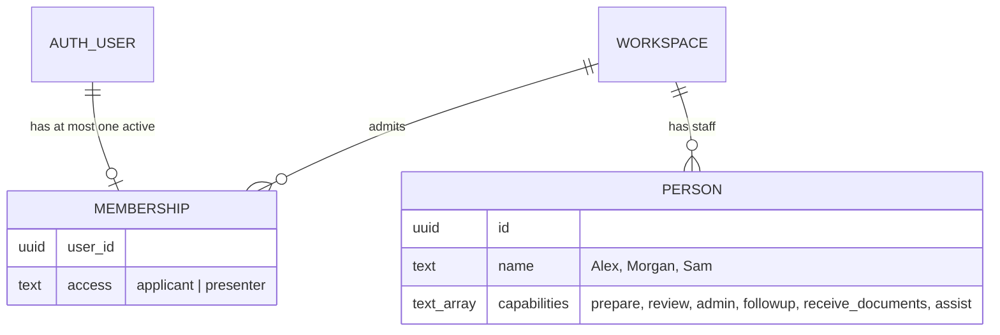
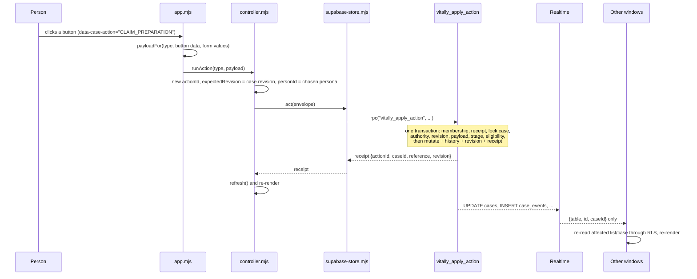

# Architecture

This page explains how the pieces fit together and why. Details for each layer are in the
[database](database.md), [front-end](frontend.md) and [back-end](backend.md) guides.

## Context and goals

The demo had to show a realistic VITA workflow across roles, in two browsers at once, with real
email sign-in and shared state, for a classroom presentation. That shaped four constraints:

- **No custom server** to build or host. The browser uses Supabase directly (design decision in the
  [design spec, section 2](../superpowers/specs/2026-09-15-vitally-shared-demo-design.md#2-user-confirmed-decisions)).
- **Static hosting** on GitHub Pages: no build step, relative paths, one JSON config file.
- **Correct under concurrency.** Two volunteers can press "claim" at the same moment; exactly one
  must win, and neither may see a false success.
- **Private by construction.** A classmate playing a client must never see another client's data
  or any staff note, even by calling the API directly.

These constraints produced an architecture where PostgreSQL is the back end. That is a sound
foundation for production too; see [key decisions](#key-decisions-and-trade-offs) for what to keep.

## Components

| Component | Where | Responsibility |
| --- | --- | --- |
| Browser app | `index.html`, `src/` | Screens, navigation, forms, live updates. Predicts permissions to hide buttons; decides nothing. |
| Supabase Auth (GoTrue) | Supabase | Email one-time-code sign-in. Accounts exist only for approved addresses. |
| PostgREST | Supabase | Exposes tables (read-only for browsers) and the five RPC functions over HTTP. |
| PostgreSQL | Supabase | Schema, row-level security, and all workflow logic in `SECURITY DEFINER` functions. |
| Realtime | Supabase | Pushes INSERT/UPDATE events on twelve tables, filtered by the same row-level security. |
| `server.mjs` | Local machine | Serves the static files and `/public-config.json` locally. Any static host can replace it. |
| `tools/admin/` | Operator's machine | Privileged tasks (migrations, roster) behind fail-closed target guards. Never in the browser. |

## Identity: accounts, memberships and people

Three separate records answer three separate questions.



- **Auth user** (`auth.users`): who signed in. Created only by the roster command, so only
  approved addresses can sign in.
- **Membership** (`public.memberships`): which workspace the account belongs to, and whether it
  is an `applicant` (a client) or a `presenter` (staff).
- **Person** (`public.people`): a staff member with capabilities. Every staff action names the
  person it is done as, and the database checks that person's capabilities.

**In the demo, people are not linked to accounts.** A presenter account chooses a persona in the
presenter panel and acts as Alex, Morgan or Sam, so one group member can demonstrate every role.
The database still enforces each persona's capabilities and independence rules, so the workflow
rules are real, but the question "is this account allowed to act as Alex?" is answered only by
"it is a presenter". This is the most important demo-only shortcut. Production needs each staff
member to have their own account linked to their own person record, with the acting person
derived from the signed-in account instead of chosen in the browser. The
[roadmap](production-roadmap.md#1-staff-identity) describes the change.

## Who can see what

Visibility is enforced by row-level security on every table (full policies in
[Database: who can see what](database.md#who-can-see-what)):

| Principal | Sees |
| --- | --- |
| Applicant | Their own cases, and on those only: document requests, their documents, and plain-language progress messages (`client_events`). |
| Presenter | Every case in the workspace **except other people's unsubmitted client drafts**, plus all staff records: people, internal history, participation, follow-ups, contact attempts, reviews, assistance items. |
| Anonymous | Nothing. |

The browser mirrors this: the applicant adapter never requests a staff table
(`CLIENT_TABLES` in [`src/supabase-store.mjs`](../../src/supabase-store.mjs)).

## How a read works

The store reads tables directly through PostgREST with the signed-in user's token. RLS filters
rows. A presenter's case list also fetches per-case summaries (participants, open follow-ups,
open requests) so the work board can show what each case is waiting for. The store turns
`snake_case` rows into the `camelCase` objects described at the bottom of
[`src/contracts.mjs`](../../src/contracts.mjs).

## How a write works

Every change is one call to a database function with an **envelope**:

```js
{ actionId, caseId, expectedRevision, personId, type, payload }
```



Three properties matter:

- **Idempotent.** The database stores a receipt per `(workspace, account, actionId)`. If the
  network drops after the database committed, the browser retries the **identical** envelope and
  gets the stored receipt back instead of acting twice. The same action id with a different
  payload is refused as `VALIDATION`.
- **Revision-fenced.** `expectedRevision` must equal the case's current revision, otherwise
  `CONFLICT`. Two simultaneous claims lock the same row; the second sees a moved revision and
  loses cleanly. The browser then re-reads and shows the newer state.
- **All or nothing.** Any refusal rolls back the whole call, including the reserved receipt.
  There is never a partial change.

The fixed order of checks, and which error each step produces, is in
[Database: check order](database.md#check-order-and-error-codes).

## How live updates work

Realtime sends INSERT and UPDATE events for twelve tables. The browser uses an event only as a
hint: it takes the table and row id, decides what might be stale (the list, the open case, the
assistance list), and **re-reads through the normal RLS-scoped queries**. It never trusts event
payloads as data. Realtime applies RLS too, so a client never receives another client's event.

Deletes are never published, because a deleted row cannot be checked against RLS. The only bulk
delete, the presenter's sample reset, announces itself by incrementing
`workspaces.fixture_generation`; every window watching the workspace re-reads everything.

## How sign-in works

1. The person types an email address. The browser calls Supabase Auth with
   `shouldCreateUser: false`, so an unknown address creates nothing.
2. The screen shows the same neutral message for known and unknown addresses, so the form cannot
   be used to discover who is on the roster.
3. The person types the code from the email. Supabase verifies it and issues a session.
4. The browser reads the account's membership. No membership means no access.

A resend cooldown (server interval plus five seconds) is enforced in the browser and survives a
reload. Details in [Front end: sign-in](frontend.md#sign-in) and
[Back end: Auth and email](backend.md#auth-and-email).

## Key decisions and trade-offs

| Decision | Why | Trade-off | Keep for production? |
| --- | --- | --- | --- |
| Business logic in `SECURITY DEFINER` SQL functions; browser roles read-only | One place enforces every rule, atomically, for every client, including direct API calls | Logic in PL/pgSQL is harder to unit-test and refactor; changing a function means copying it into a new migration | Yes, or move it to a service that keeps the same contract |
| Browser talks to Supabase directly | No server to build or host | No place for server-side integrations (email notifications, file scanning, reports) | Add a service beside it for integrations; the RPC contract can stay |
| Client-generated action ids with stored receipts | Safe retries on flaky networks; no double actions | One extra row per action | Yes |
| Per-case `revision` fencing | Concurrency without locks held across requests | Users sometimes see "someone else changed this" and must retry | Yes |
| Realtime events carry ids only; browser re-reads | No private data in the event stream; one code path for data | More reads per change | Yes |
| Inline RLS predicates, repeated per table | Avoids granting browsers EXECUTE on helper functions | Seven copies of the case-visibility rule must stay in agreement (a test checks this) | Revisit; a view or helper with care |
| Vanilla ES modules, no framework, no build | Static hosting, nothing to install to view | Full-page re-render needs hand-written focus and draft preservation | Probably not; see [front end](frontend.md#moving-to-a-framework) |
| Committed, pinned Supabase SDK bundle | Works from any static host, reproducible | Must be rebuilt by hand on upgrade | Replaced by a normal build if a framework is adopted |
| Presenter personas | One person can demonstrate every role | Not a real staff identity model | **No.** Must be replaced |
| Sample cases, reset and checkpoints in the database | Repeatable demonstrations | Demo-only functions and columns in the schema | **No.** Remove or restrict to non-production environments |

## Real versus simulated

| Real | Simulated |
| --- | --- |
| Email one-time-code sign-in and sessions | Document upload: one fixed fictional file name, no file storage |
| Shared state across browsers, live updates | Reminders: a timestamp, no message is sent |
| Every permission, eligibility and independence rule | TaxSlayer milestones: recorded by hand, no integration |
| Concurrency, idempotency, audit history | Intake checks (interview, identity, documents, consent): tick boxes |
| Row-level privacy between clients | Client phone calls: outcomes are recorded, calls happen elsewhere |
