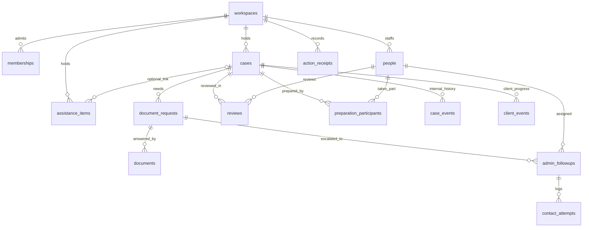
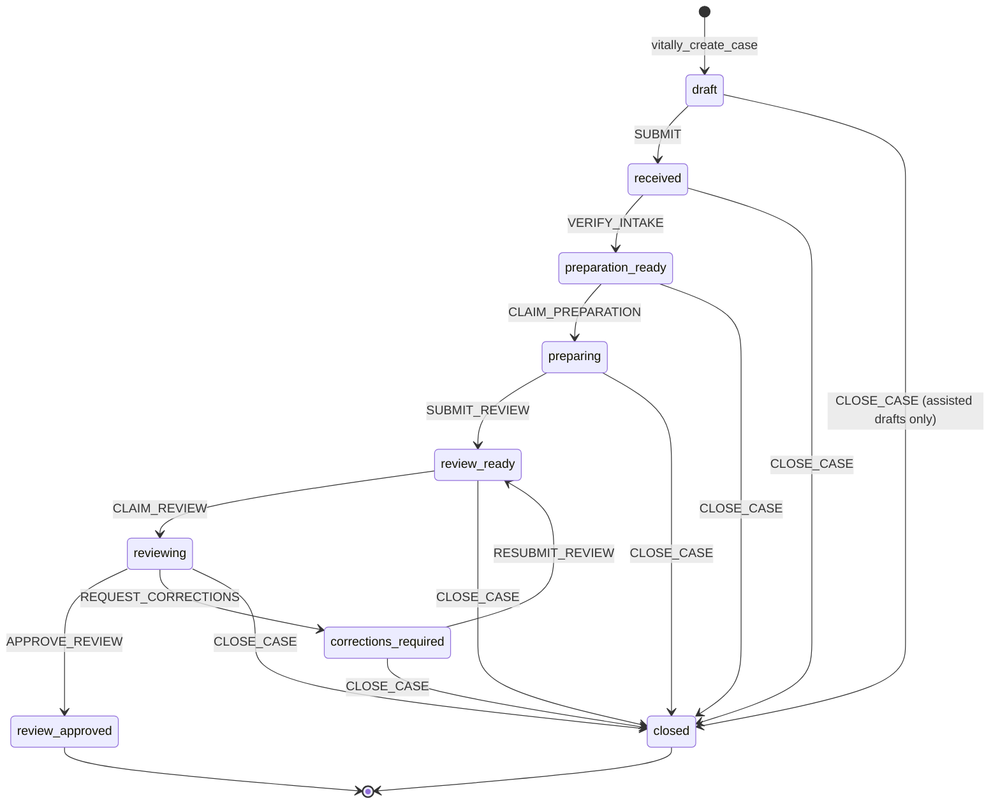

# Database

PostgreSQL on Supabase is ViTally's back end. It holds the data, decides who can read which rows,
and runs every workflow change inside one function call. This page is the reference for all of
it. Run everything described here against the local stack from [`docs/setup.md`](../setup.md).

## Contents

- [Migrations](#migrations)
- [Schema](#schema)
- [Who can see what](#who-can-see-what)
- [The action API](#the-action-api)
- [The case state machine](#the-case-state-machine)
- [Action catalogue](#action-catalogue)
- [Check order and error codes](#check-order-and-error-codes)
- [Concurrency and idempotency](#concurrency-and-idempotency)
- [Realtime](#realtime)
- [Sample cases, reset and checkpoints (demo only)](#sample-cases-reset-and-checkpoints-demo-only)
- [Changing the database](#changing-the-database)
- [Recipes](#recipes)
- [Testing](#testing)

## Migrations

The schema is nine plain SQL files in [`supabase/migrations/`](../../supabase/migrations/), applied
in order by [`tools/admin/migrate.mjs`](../../tools/admin/migrate.mjs).

| File | Adds |
| --- | --- |
| `001_identity_and_cases.sql` | Workspaces, memberships, people, cases, action receipts; `vitally_create_case`; the workspace initializer; base RLS |
| `002_workflow_schema.sql` | Document requests, documents, admin follow-ups, contact attempts, internal and client history, participation, assistance items; their RLS |
| `003_action_core.sql` | `vitally_apply_action` and its shared checks; intake actions and the preparation claim |
| `004_documents_followup.sql` | Document request/response/verification; admin follow-up escalation, contact, resolution |
| `005_assistance_closure.sql` | Assistance items' own entry point; reminders; case closure |
| `006_review.sql` | The `reviews` table and every review action; the final version of the dispatcher |
| `007_realtime_publication.sql` | The twelve tables published to Realtime, INSERT and UPDATE only |
| `008_case_timestamps.sql` | `cases.created_at` and `cases.updated_at`; the final `commit_action` |
| `009_fixtures_and_realtime.sql` | Six sample cases, presenter reset, checkpoints (demo only) |

Later migrations replace earlier functions with `create or replace`. When you need the current
version of a function, use the **last** file that defines it:

| Function | Current definition |
| --- | --- |
| `public.vitally_apply_action` | `006_review.sql` |
| `vitally_private.check_operation_authority`, `check_payload` | `006_review.sql` |
| `vitally_private.check_authority`, `check_related` | `004_documents_followup.sql` |
| `vitally_private.commit_action` | `008_case_timestamps.sql` |
| `public.vitally_create_case`, `vitally_private.initialize_workspace` | `001_identity_and_cases.sql` |
| `vitally_private.intake_answer_keys`, `act_submit` | `003_action_core.sql` |
| `public.vitally_assistance_action` | `005_assistance_closure.sql` |

To list every function with its file and line:

```sh
grep -n -E "^create (or replace )?function" supabase/migrations/*.sql
```

## Schema

Two schemas:

- **`public`**: the application tables and the five browser-callable functions.
- **`vitally_private`**: helper functions, the migration ledger, and tables browsers must never
  reach. Every function here is `SECURITY DEFINER` with `search_path=''`, and `EXECUTE` is revoked
  from every role, including `service_role`.

Every application row carries `workspace_id`, and foreign keys are **composite**
(`(workspace_id, id)`), so a row can never point at a record in another workspace.



### Tables

| Table | Purpose | Notable columns and rules |
| --- | --- | --- |
| `workspaces` | One site's data set | `default_followup_person_id` (who gets escalations), `fixture_generation` (moves on every sample reset) |
| `memberships` | Account access to a workspace | `access` is `applicant` or `presenter`; `active`; **one active membership per account** (unique index) |
| `people` | Staff members | `person_key` (`alex`, `morgan`, `sam`), `name`, `capabilities` from `prepare`, `review`, `admin`, `followup`, `receive_documents`, `assist` |
| `cases` | One client application | `reference` (`VT-XXXX-XXXX`, unique), `origin` (`client`, `assisted`, `fixture`), `owner_user_id` (the client account; null for assisted and unbound sample cases), `answers` (JSON object of strings), `stage`, `revision`, `preparation_version`, `intake_verified`, `preparer_id`, `reviewer_id`, `last_reminded_*`, `created_at`, `updated_at` |
| `action_receipts` | One row per accepted or in-flight action | Unique `(workspace_id, actor_user_id, action_id)`; `request_digest` (SHA-256 of the envelope); `receipt` (the stored result). No foreign key to the target, so receipts outlive deleted cases |
| `preparation_participants` | Who ever prepared a case | Primary key `(case_id, person_id)`. Written on a preparation claim and never removed. Blocks self-review |
| `document_requests` | A preparer asking for a document | `status`: `open` → `awaiting_verification` → `verified`, or `cancelled` on closure |
| `documents` | A received document (metadata only) | `source` is `client` (no person) or `staff_recorded` (a person); `filename` only, **no file storage** |
| `admin_followups` | An office task to contact a client about a request | `status`: `open`, `resolved`, `cancelled`; at most one open task per request; resolution outcome `reached` or `no_further_contact` |
| `contact_attempts` | One recorded call attempt on a follow-up | `outcome`: `no_answer`, `reached`, `no_further_contact`, `closure_requested`; recording never resolves the task |
| `reviews` | One review attempt of one preparation version | `status`: `active`, `corrections_requested`, `approved`, `superseded`; one active per case; `findings`, `resolution`, `client_contact_*` |
| `case_events` | Internal audit history, staff-only | `action`, `actor_user_id`, `actor_person_id`, `detail` (JSON), `created_at`. One row per accepted action |
| `client_events` | Plain-language progress a client may read | `action`, `message`. Written only when an action has something to tell the client |
| `assistance_items` | Requests for help with forms, beside the tax workflow | Own `revision`; `status`: `open` → `assigned` → `resolved`; optional `case_id`; `language`, `contact_preference` |
| `vitally_private.schema_migrations` | Migration ledger | `name`, `digest` (SHA-256 of the file) |
| `vitally_private.fixture_client_bindings` | Which client account owns which sample case | Demo only |
| `vitally_private.test_workspaces` | Workspaces created by test runs | Test only |

Every text column has a length check, and every status column has an allowed-values check. To see
all of them, open `psql` inside the local stack's database container (no password or URL needed)
and describe a table:

```sh
docker exec -it supabase_db_<your-instance-id> psql -U postgres
```

```text
postgres=# \d+ public.cases
postgres=# \df vitally_private.*
postgres=# select tablename, policyname, qual from pg_policies where schemaname = 'public';
```

## Who can see what

Row-level security is enabled on every `public` table. Browsers have `SELECT` only; there is no
`INSERT`, `UPDATE` or `DELETE` grant for `anon` or `authenticated` on any table, and `anon` has no
grants at all.

| Table | Applicant (client) | Presenter (staff) |
| --- | --- | --- |
| `cases` | Own cases | All cases except client drafts not yet submitted |
| `document_requests`, `documents`, `client_events` | On own cases | On visible cases |
| `case_events`, `preparation_participants`, `admin_followups`, `contact_attempts`, `reviews` | Nothing | On visible cases |
| `assistance_items` | Nothing | All unlinked items, and items on visible cases |
| `people` | Nothing | Everyone in the workspace |
| `memberships` | Own active membership | Own active membership |
| `workspaces` | Own workspace | Own workspace |
| `action_receipts` | Nothing (no policy, no grant) | Nothing |

The case-visibility rule appears inline in each policy:

```sql
exists (select 1 from memberships m
        where m.workspace_id = <row>.workspace_id
          and m.user_id = (select auth.uid()) and m.active
          and ((m.access = 'applicant' and <case>.owner_user_id = m.user_id)
            or (m.access = 'presenter' and (<case>.origin <> 'client' or <case>.stage <> 'draft'))))
```

It is repeated rather than put in a helper function because a helper would need `EXECUTE` granted
to browsers. A database test checks that all copies agree. If you change the rule, change every
policy and `vitally_private.lock_case` (which applies the same rule to writes) in one migration.

## The action API

Browsers can call exactly five functions. Each runs as its owner (`SECURITY DEFINER`), checks the
caller itself, and returns a JSON receipt.

| Function | Purpose | Returns |
| --- | --- | --- |
| `vitally_create_case(p_action_id uuid, p_mode text, p_person_id uuid, p_answers jsonb)` | New draft. `p_mode` is `client` (an applicant, no person) or `assisted` (a presenter acting as an `admin` person, for a walk-in client) | `{actionId, caseId, reference, revision}` |
| `vitally_apply_action(p_action_id uuid, p_case_id uuid, p_expected_revision bigint, p_person_id uuid, p_type text, p_payload jsonb)` | Every case workflow action (19 types) | `{actionId, caseId, reference, revision}` |
| `vitally_assistance_action(p_action_id uuid, p_item_id uuid, p_expected_revision bigint, p_person_id uuid, p_type text, p_note text)` | `CLAIM` or `RESOLVE` an assistance item | `{actionId, itemId, revision}` |
| `vitally_reset_fixtures(p_action_id uuid)` | Demo only: rebuild the six sample cases | `{actionId, generation, fixtureCaseIds}` |
| `vitally_load_checkpoint(p_action_id uuid, p_case_id uuid, p_expected_revision bigint, p_checkpoint text)` | Demo only: move one sample case to a story point | `{actionId, caseId, reference, revision}` |

`p_person_id` is the staff person the caller acts as. Applicants must send `null`. Presenters send
the persona they chose.

The exact signatures are pinned by a test ([`tests/support/rpc-signatures.mjs`](../../tests/support/rpc-signatures.mjs)),
so adding a sixth function or changing an argument fails the database suite until the list is
updated.

### Calling it

From the browser (supabase-js):

```js
const { data: receipt, error } = await supabase.rpc("vitally_apply_action", {
  p_action_id: crypto.randomUUID(),   // keep it: a retry must reuse it
  p_case_id: caseId,
  p_expected_revision: currentRevision,
  p_person_id: actingPersonId,        // null for a client
  p_type: "REQUEST_DOCUMENT",
  p_payload: { title: "Mileage record", message: "Please send your 2025 mileage log." },
});
// error.code is "VT001".."VT007", "42501", or absent for a network failure
```

From SQL, impersonate a signed-in user inside a transaction; the functions read `auth.uid()` from
the JWT claims:

```sql
begin;
set local role authenticated;
set local request.jwt.claims = '{"sub": "<auth user id>", "role": "authenticated"}';
select public.vitally_apply_action(gen_random_uuid(), '<case id>', 3, '<person id>', 'CLAIM_PREPARATION', '{}');
rollback;
```

`psql` prints a refusal as `ERROR:  VALIDATION`; run `\set VERBOSITY verbose` first to also see the
`VT00N` code.

## The case state machine



Document requests, admin follow-ups and review contact are **not stages**. They are records beside
the stage that can block a transition: `SUBMIT_REVIEW` and `RESUBMIT_REVIEW` refuse while any
document request is `open` or `awaiting_verification`. An open admin follow-up never blocks
preparation.

`review_approved` is the end of the demo. The product spec's later states (signature, e-filing,
client not reachable) are not built; see the [roadmap](production-roadmap.md#4-workflow-coverage).

## Action catalogue

"Presenter + person" means a presenter account acting as a staff person. Capabilities in step 7
are checked after the stage, so a wrong stage is reported before a missing qualification. Two
shorthands in the table:

- **Current preparer** (`require_case_preparer`): the person has `prepare` (else `INELIGIBLE`), is
  the case's `preparer_id`, and is recorded as a participant (else `FORBIDDEN`).
- **Current reviewer** (`require_case_reviewer`): the person never took part in preparing the case
  (else `SELF_REVIEW`), has `review` (else `INELIGIBLE`), and is the case's `reviewer_id` (else
  `FORBIDDEN`).

| Action | Who (step 4) | Allowed when (step 6) | Also requires (step 7) | Effect | Client message |
| --- | --- | --- | --- | --- | --- |
| `SAVE_ANSWERS` | Applicant owner, or presenter + `admin` person on an assisted case | `draft` | | Merges answers | No |
| `SUBMIT` | Same as above | `draft` | Server re-checks required answers and screening | → `received` | Yes |
| `VERIFY_INTAKE` | Presenter + `admin` person | `received` | | → `preparation_ready`, `intake_verified` | Yes |
| `CLAIM_PREPARATION` | Presenter + any person | `preparation_ready`, no preparer | `prepare` | → `preparing`; sets preparer; records participation | Yes |
| `REQUEST_DOCUMENT` | Presenter + person | `preparing`, `corrections_required` | Current preparer | New `open` request | Yes (title) |
| `RESPOND_DOCUMENT` | Applicant owner | `preparing`, `corrections_required` | Request is `open` | Client document; request → `awaiting_verification` | Yes |
| `RECORD_DOCUMENT_RESPONSE` | Presenter + `receive_documents` person, case has no owner | `preparing`, `corrections_required` | Request is `open` | Staff-recorded document; request → `awaiting_verification` | Yes |
| `VERIFY_DOCUMENT` | Presenter + person | `preparing`, `corrections_required` | Current preparer; request `awaiting_verification` | Request → `verified` | Yes |
| `ESCALATE_CONTACT` | Presenter + person | `preparing`, `corrections_required` | Current preparer; request `open`; no open task | Follow-up assigned to the workspace's default follow-up person | No |
| `RECORD_CONTACT` | Presenter + `followup` person | (any; task must be open) | Assignee; task `open` | Contact attempt row | No |
| `RESOLVE_FOLLOWUP` | Presenter + `followup` person | (any; task must be open) | Assignee; task `open` | Task → `resolved` | No |
| `SUBMIT_REVIEW` | Presenter + person | `preparing` | Current preparer; intake verified; no unsettled request | Version + 1; → `review_ready`; active review superseded | Yes |
| `CLAIM_REVIEW` | Presenter + person | `review_ready`, no reviewer | Not a participant (`SELF_REVIEW`); `review` | → `reviewing`; sets reviewer; new `active` review | Yes |
| `REQUEST_CORRECTIONS` | Presenter + person | `reviewing` | Current reviewer; review at current version | Review → `corrections_requested` with findings; → `corrections_required`; reviewer cleared | Yes (no findings) |
| `RESUBMIT_REVIEW` | Presenter + person | `corrections_required` | Current preparer; no unsettled request | Resolution saved; version + 1; → `review_ready` | Yes |
| `APPROVE_REVIEW` | Presenter + person | `reviewing` | Current reviewer; review at current version | Review → `approved`, contact `pending`; → `review_approved` | Yes |
| `RECORD_REVIEW_CONTACT` | Presenter + person | `review_approved` | Current reviewer; contact `pending` | Outcome saved; `reached` or `no_further_contact` completes it | Only when completed |
| `REMIND` | Presenter + `admin` person | `preparation_ready` with no preparer, or `review_ready` with no reviewer | | Sets `last_reminded_at` (no message is sent) | No |
| `CLOSE_CASE` | Presenter + `admin` person | `received` through `corrections_required`, or an assisted `draft` | | → `closed`; cancels open requests and tasks | Yes |

Payload shapes are whitelisted exactly in `vitally_private.check_payload`; an extra key is a
`VALIDATION` error, not ignored. The browser builds them in
[`src/case-actions.mjs`](../../src/case-actions.mjs). Summary:

| Action | Payload |
| --- | --- |
| `SAVE_ANSWERS` | `{answers: {<intake key>: string}}` |
| `SUBMIT` | `{confirmed: true}` |
| `VERIFY_INTAKE` | `{checks: {interview: true, identity: true, documents: true, consent: true}}` |
| `CLAIM_PREPARATION`, `SUBMIT_REVIEW`, `CLAIM_REVIEW`, `APPROVE_REVIEW`, `REMIND` | `{}` |
| `REQUEST_DOCUMENT` | `{title (≤120), message (≤2000)}` |
| `RESPOND_DOCUMENT`, `RECORD_DOCUMENT_RESPONSE` | `{requestId, filename: "demo-mileage-record-2025.pdf"}` |
| `VERIFY_DOCUMENT` | `{requestId}` |
| `ESCALATE_CONTACT` | `{requestId, reason (≤1000)}` |
| `RECORD_CONTACT`, `RESOLVE_FOLLOWUP` | `{followupId, outcome, note (≤1000)}` |
| `REQUEST_CORRECTIONS` | `{findings (≤2000)}` |
| `RESUBMIT_REVIEW` | `{resolution (≤2000)}` |
| `RECORD_REVIEW_CONTACT` | `{outcome, note (≤1000)}` |
| `CLOSE_CASE` | `{confirmed: true, reason (≤1000)}` |

Assistance items have their own two actions through `vitally_assistance_action`: `CLAIM` (item
`open` → `assigned`, needs `assist`, no note) and `RESOLVE` (`assigned` → `resolved`, only the
assignee, note required). They write no case history.

## Check order and error codes

Every case action runs the same checks in the same order. The order is part of the contract: it
decides which error a caller sees when several things are wrong, and it stops a caller from
learning about records they may not see.

| Step | Check | Error |
| --- | --- | --- |
| 1 | Signed in with an active membership | `VT001` `FORBIDDEN` |
| 2 | Reserve the receipt for this action id; identical replay returns the stored receipt; changed envelope refused | `VT007` `VALIDATION` |
| 3 | Lock the case through the visibility rule; missing, other workspace and another client's case look identical | `VT002` `NOT_FOUND` |
| 4 | Operational authority: applicant vs presenter, the person belongs to this workspace, operational capabilities (`admin`, `followup`, `receive_documents`, `assist`); unknown action type | `VT001` `FORBIDDEN`, `VT007` |
| 5 | Expected revision, then payload shape, then related records belong to this case | `VT003` `CONFLICT`, then `VT007` |
| 6 | Stage window | `VT004` `INVALID_TRANSITION` |
| 7 | Self-review, then `prepare`/`review` qualification, then current assignment, then readiness | `VT005` `SELF_REVIEW`, `VT006` `INELIGIBLE`, `VT001`, `VT004` |
| 8 | Mutate, append `case_events` (and `client_events`), bump revision and `updated_at`, store receipt | |

| SQLSTATE | Domain code | Safe message shown |
| --- | --- | --- |
| `VT001` | `FORBIDDEN` | You do not have access to this step. |
| `VT002` | `NOT_FOUND` | This application is no longer available. |
| `VT003` | `CONFLICT` | Someone else updated this application. Refresh and try again. |
| `VT004` | `INVALID_TRANSITION` | This step is not available right now. |
| `VT005` | `SELF_REVIEW` | A different volunteer has to review this application. |
| `VT006` | `INELIGIBLE` | This volunteer is not qualified for this step. |
| `VT007` | `VALIDATION` | Please check the information and try again. |
| `42501` | `FORBIDDEN` | |
| none (network) | `OFFLINE` | The demo cannot reach the server. |
| anything else | `SERVER_ERROR` | Something went wrong. |

Always raise errors as `raise sqlstate 'VT00N' using message='NAME'`. Never raise untyped
exceptions from an application path; the browser would show them as `SERVER_ERROR`.

## Concurrency and idempotency

- **Row lock plus revision.** Step 3 takes `SELECT ... FOR UPDATE` on the case. A second
  simultaneous action waits, then fails step 5 because the revision moved. Exactly one wins.
- **Receipts.** The envelope is digested with SHA-256 (`extensions.digest`). The same action id
  with the same digest returns the stored receipt without re-running anything, even if the case
  was deleted since. The same id with a different digest is `VALIDATION`.
- **Nothing partial.** Any raise rolls back the whole call, including the receipt reservation.
- **Workspace setup and reset** take a transaction-scoped advisory lock per workspace, so two
  presenters resetting at once serialize instead of colliding.

## Realtime

`007_realtime_publication.sql` publishes twelve tables to `supabase_realtime`, INSERT and UPDATE
only: `cases`, `document_requests`, `documents`, `client_events`, `workspaces`, `people`,
`preparation_participants`, `admin_followups`, `contact_attempts`, `case_events`,
`assistance_items`, `reviews`. `action_receipts` is not published.

Realtime applies each subscriber's RLS, so the same visibility rules hold for events. Deletes are
not published because a deleted row cannot be authorized. The browser treats events as "something
changed" hints and re-reads. If you add a table the browser should watch, add it to the
publication in a new migration **and** to `SUBSCRIBED_TABLES` in
[`src/supabase-store.mjs`](../../src/supabase-store.mjs); a test asserts the two lists match.

## Sample cases, reset and checkpoints (demo only)

Migration 009 seeds six sample cases, one per story point (`preparation_ready`,
`waiting_documents`, `admin_followup`, `review_ready`, `corrections_required`,
`review_approved`), with fictional answers and history.

- **Reset** (`vitally_reset_fixtures`, presenters only) deletes only rows marked `fixture`,
  increments `workspaces.fixture_generation`, and reseeds. Class-created cases, accounts, people
  and receipts are untouched. Reseeded cases get new ids and references.
- **Checkpoint** (`vitally_load_checkpoint`, presenters only) rewrites one sample case's workflow
  records to a named story point: `intake_ready`, `document_requested`, `admin_followup_needed`,
  `ready_for_review`, `corrections_required`. The case keeps its id, reference and owner.
- **Bindings** (`vitally_private.fixture_client_bindings`) let a client account own a sample case
  after every reset. The roster command sets them from `sampleCaseOwners`.

None of this belongs in production. See the [roadmap](production-roadmap.md#5-demo-only-parts).

## Changing the database

1. **Never edit a migration that has been applied anywhere.** The migrator stores each file's
   SHA-256 in `vitally_private.schema_migrations` and stops with `MIGRATION_CHANGED` if an applied
   file changes. Add a new numbered file instead: `010_short_name.sql`.
2. **Files are applied once, in name order.** Each run applies every pending file inside one
   transaction and skips files already recorded, so a failure applies nothing. The files are not
   written to be re-run by hand.
3. **To change a function, copy its current definition** (see the table in
   [Migrations](#migrations)) into the new file as `create or replace`, then edit it. Keep the
   `security definer set search_path=''` header.
4. **Re-apply grants in the same file.** End every migration that touches functions with:

   ```sql
   revoke all on all functions in schema vitally_private from public, anon, authenticated, service_role;
   ```

   and, for any `public` function you created or replaced, `revoke all ... from public, anon,
   authenticated; grant execute ... to authenticated;`.
5. **New tables:** composite foreign keys through `workspace_id`, `enable row level security`, one
   `SELECT` policy for `authenticated`, `grant select` only, length and value `CHECK`s, and a
   decision about Realtime.
6. **Apply and test:**

   ```sh
   npm run db:migrate:test
   npm run test:database
   ```

   (with the Node and Docker `PATH` prefix from [`docs/setup.md`](../setup.md#5-tests)).

## Recipes

### Add a workflow action

Example: a reviewer can "release" a review they claimed by mistake.

1. **Vocabulary.** Add `RELEASE_REVIEW` to `CASE_ACTIONS` in [`src/contracts.mjs`](../../src/contracts.mjs).
2. **Migration `010_release_review.sql`:**
   - `create or replace vitally_private.check_operation_authority` (from 006) with the new type in
     the right authority group.
   - `create or replace vitally_private.check_payload` (from 006) with the payload shape.
   - A new `vitally_private.act_release_review(p_member, p_case, p_person, p_payload)`: stage check
     first (`VT004`), then `require_case_reviewer`, then the change. Return
     `{detail: {...}}` and, if the client should be told, `message`.
   - `create or replace public.vitally_apply_action` (from 006) with one new `when` branch.
   - Re-apply grants (see above).
3. **Browser.** A payload builder in [`src/case-actions.mjs`](../../src/case-actions.mjs), an
   eligibility rule in `staffEligibility` ([`src/staff-views.mjs`](../../src/staff-views.mjs)), and
   a button with `data-case-action="RELEASE_REVIEW"`. See
   [Front end: add a button for an action](frontend.md#add-a-button-for-a-new-action).
4. **Tests.** A database test for success, every refusal in check order, and "a rejected action
   commits nothing"; unit tests for the payload builder and eligibility.

### Change the intake questions

The intake answers are a whitelist of 17 keys, stored as strings in `cases.answers`. The list
appears in four places that must agree:

| Where | What |
| --- | --- |
| [`src/domain.mjs`](../../src/domain.mjs) | `INTAKE_ANSWER_KEYS`, `REQUIRED_ANSWER_KEYS`, `screening`, `submissionBlocker` |
| `vitally_private.intake_answer_keys()` (003) | The whitelist `SAVE_ANSWERS` accepts |
| `public.vitally_create_case` (001) | Its own inline copy of the whitelist |
| `vitally_private.act_submit` (003) | The required keys and screening rules re-checked on submit |

Plus the browser presentation: `ANSWER_LABELS` in [`src/ui.mjs`](../../src/ui.mjs) (a test pins it
to `INTAKE_ANSWER_KEYS`), the form steps in [`src/client-views.mjs`](../../src/client-views.mjs),
the fictional filler in [`src/sample-data.mjs`](../../src/sample-data.mjs), and the seeded answers
in `vitally_private.fixture_answers` (009).

Write one new migration that replaces `intake_answer_keys`, `vitally_create_case`, `act_submit`
and `fixture_answers` together. Existing cases keep old keys in `answers`; decide whether to
migrate them. The database tests assert that saving every `INTAKE_ANSWER_KEYS` key works and that
the fixture answers use exactly those keys, so a mismatch fails fast.

If the new form needs non-string answers (numbers, dates, lists), `SAVE_ANSWERS` currently
refuses any non-string value; change `check_payload` deliberately.

### Add a staff capability

1. Extend the `people_capabilities_check` constraint in a new migration.
2. Decide whether the check is operational (step 4, `FORBIDDEN`) or a qualification (step 7,
   `INELIGIBLE`), and add it in the matching function.
3. Give it to people through the workspace initializer or a setup script, and mirror it in the
   browser's eligibility helpers.

## Testing

The database suite (`tests/database*.mjs`, 151 tests) runs against the local stack only. Each test
file builds a throwaway workspace with fresh synthetic accounts through
[`tests/support/database-fixture.mjs`](../../tests/support/database-fixture.mjs) and deletes it
afterwards, so tests are independent and leave your rehearsal workspace alone.

What the suite covers, by file:

| File | Covers |
| --- | --- |
| `database.mjs` | Identity, references, ownership, RLS, grants, workspace setup |
| `database-actions.mjs` | The check order, receipts, replay, forged identities, payload whitelists |
| `database-documents.mjs` | Requests, responses, verification, follow-up tasks |
| `database-assistance.mjs` | Assistance items, reminders, closure |
| `database-review.mjs` | Review, corrections, independence, reassignment |
| `database-fixtures.mjs` | Sample seeding, reset, checkpoints |
| `database-realtime.mjs` | Realtime privacy between clients and for staff tables |
| `database-store.mjs` | The browser's data adapter against the real database |

Every privileged connection passes the target guard in
[`tools/admin/test-target.mjs`](../../tools/admin/test-target.mjs): loopback addresses only, the
exact container names and ports recorded in `.vitally-targets.json`, and a matching project label.
It is deliberately impossible to point the test suite at a hosted project by accident.

When you add behaviour, test three things: it works; each refusal happens at the right step with
the right code; and a refused call leaves no receipt, event or change behind.
