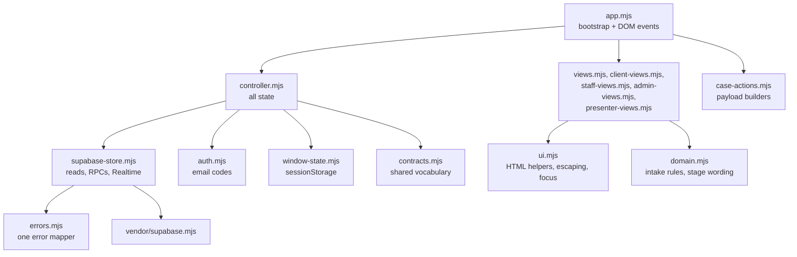

# Front end

The browser app is plain JavaScript ES modules with no framework, no bundler and no build step.
`index.html` loads [`src/app.mjs`](../../src/app.mjs) as a module, and the browser fetches the rest
of `src/` directly. The only third-party code is the Supabase SDK, committed as a pinned bundle in
[`src/vendor/supabase.mjs`](../../src/vendor/supabase.mjs).

The front end **predicts** what a person may do so it can show the right buttons, but the
[database](database.md#the-action-api) decides. Never move a rule into the browser alone.

## Contents

- [Module map](#module-map)
- [Boot sequence](#boot-sequence)
- [The controller](#the-controller)
- [Screens](#screens)
- [Rendering](#rendering)
- [Events and actions](#events-and-actions)
- [Errors, conflicts and retries](#errors-conflicts-and-retries)
- [Live updates](#live-updates)
- [Sign-in](#sign-in)
- [Window state](#window-state)
- [Styling and accessibility](#styling-and-accessibility)
- [Testing](#testing)
- [Recipes](#recipes)
- [Moving to a framework](#moving-to-a-framework)

## Module map



Dependency rules that keep the pieces testable:

- **Views are pure.** They take state and return an HTML string. They never import the controller,
  the store or the SDK, and never touch the DOM.
- **The controller renders nothing.** It owns state and calls an injected `render()`. It receives
  `store` and `auth` as arguments, so tests run it against doubles.
- **Only the store talks to Supabase.** Only `app.mjs` imports the SDK, and only to create the
  client it hands to the store and auth modules.
- **`app.mjs` holds no state and writes no HTML.** It reads configuration, builds the modules, and
  turns DOM events into controller calls.

## Boot sequence

1. `app.mjs` fetches `./public-config.json` (relative, so it works under a GitHub Pages subpath).
2. If the file is missing or says `{"configured": false}`, it renders the "ViTally is not configured
   yet" screen and stops before loading the SDK.
3. Otherwise it imports the SDK bundle and creates the Supabase client with the URL and
   publishable key from the config.
4. It creates `auth` ([`auth.mjs`](../../src/auth.mjs)), `store`
   ([`supabase-store.mjs`](../../src/supabase-store.mjs)) and the controller, passing `render`,
   `window.sessionStorage` and `window` (for online/focus events).
5. The controller restores the session, reads the membership, loads the right data, subscribes
   to Realtime, and renders.

## The controller

[`src/controller.mjs`](../../src/controller.mjs) is the single source of browser state. The main
fields:

| Field | Meaning |
| --- | --- |
| `session`, `principal` | Sign-in status (`unknown`, `none`, `present`) and `{userId, workspaceId, access, email}` |
| `connection` | `online`, `reconnecting`, `offline` |
| `cases`, `people`, `assistance`, `workspace` | Lists for the current screen (people, assistance and workspace for presenters only) |
| `savedCase` | The open case exactly as the server last returned it |
| `draftAnswers`, `dirty`, `editBaseRevision`, `conflict`, `saveState` | The intake form's unsaved edits, kept apart from `savedCase` |
| `screen`, `selectedCaseId`, `selectedPersonId`, `formStep`, `openPanels`, `boardFilters` | Window-local navigation, remembered per window |
| `busy`, `error`, `retryable`, `notice`, `dialog` | What the page should show right now |

Its public API is the list at the end of the file: `start`, `stop`, `getState`, `refresh`,
sign-in (`sendCode`, `verifyCode`, `editAuthEmail`, `editAuthCode`, `restartSignIn`, `signOut`,
`cooldownRemaining`), cases (`selectCase`, `createCase`, `createAssistedCase`, `editAnswers`,
`saveAnswers`, `reconcileAnswers`, `runAction`, `retryLast`), assistance
(`runAssistanceAction`), presenter tools (`selectPerson`, `resetFixtures`, `loadCheckpoint`), and
navigation (`navigate`, `setFormStep`, `togglePanel`, `setBoardFilter`, `clearBoardFilters`,
`setLookup`, `openDialog`, `closeDialog`, `dismissError`).

Three rules the controller keeps:

1. **Saved and draft are different.** A live update replaces `savedCase` but never rewrites what
   someone typed. If the server's version changed under unsaved edits, `conflict` is set and saving
   is refused until the person chooses mine or theirs (`reconcileAnswers`).
2. **An unknown outcome keeps its envelope.** On `OFFLINE` or `SERVER_ERROR` the exact envelope is
   kept, and "Try again" (`retryLast`) resends it unchanged so the database replays its receipt
   instead of acting twice.
3. **Answers are whitelisted once.** Only `INTAKE_ANSWER_KEYS` ever reach `answers`.

## Screens

`app.mjs` picks the screen from state (`screenFor`):

| Who | Screens |
| --- | --- |
| Signed out | Email and code form ([`client-views.mjs`](../../src/client-views.mjs) `accessScreen`); "cannot reach the server" and "no access" screens ([`views.mjs`](../../src/views.mjs)) |
| Applicant | `applications` (list and lookup by Application ID), `reference` (new ID to keep), `intake` (four-step form), `progress` (status, requests, send document) |
| Presenter | Volunteer work board and case ([`staff-views.mjs`](../../src/staff-views.mjs)); office board and case when the chosen persona has `admin` ([`admin-views.mjs`](../../src/admin-views.mjs)); the presenter panel on top ([`presenter-views.mjs`](../../src/presenter-views.mjs), demo only) |

## Rendering

Every state change calls `render()`, which rebuilds the whole page:

```js
root.innerHTML = views.page(state, screenFor(state));
```

This is simple and makes every screen a pure function, but a full rebuild destroys the element
that had keyboard focus and any text typed into fields that are not in state. Four mechanisms
compensate, all in `app.mjs` and [`ui.mjs`](../../src/ui.mjs):

- **Focus restore.** Before rebuilding, `describeFocus` records the focused element's id, name,
  action and related row ids; afterwards `restoreField` finds the same control again. A control
  whose row disappeared gets no focus rather than another row's button.
- **Staff form drafts.** Text typed in staff forms (reasons, notes, findings) is kept in a
  `formDrafts` map by field id and put back after each rebuild. It is cleared only for the form
  that was submitted.
- **In-place patches.** The sign-in countdown and the intake save indicator update their text
  without a rebuild, so they never interrupt typing.
- **Dialogs** take focus when they open and return it to the control that opened them.

**Escape everything.** Views build HTML strings, so every interpolated value must go through
`esc()` from `ui.mjs`. The helpers (`input`, `textarea`, `select`, `button`, `caseButton`) escape
for you; raw template literals do not.

## Events and actions

`app.mjs` listens once on the root for `click`, `input`, `change` and `submit` (and on the document
for `keydown`, for Escape and dialog focus), and reads data attributes:

| Attribute | Meaning | Handled by |
| --- | --- | --- |
| `data-action="open-case"` | Navigation or a UI toggle | The `runNavigation` switch in `app.mjs` |
| `data-case-action="VERIFY_DOCUMENT"` | A workflow action | `payloadFor` then `controller.runAction` |
| `data-assistance-action="CLAIM"` | An assistance item action | `controller.runAssistanceAction` |
| `data-case-id`, `data-request-id`, `data-followup-id`, `data-item-id` | Which row the control belongs to | Payload builders and focus restore |

A workflow button inside a `<form class="staff-form">` submits the form; `payloadFor(type,
button.dataset, formValues)` in [`case-actions.mjs`](../../src/case-actions.mjs) builds the payload
and refuses locally anything the database would refuse for certain (unknown type, missing required
text, missing related id). The controller then adds the envelope fields and sends it.

Field ids come from `fieldId(name, scope)`. Any control repeated per row must pass the row id as
`scope` and carry the row's `data-*-id`, so two rows never share an id.

## Errors, conflicts and retries

Every failure reaches the controller as an error with a `code` from `ERROR_CODES`
([`contracts.mjs`](../../src/contracts.mjs)), mapped once in
[`errors.mjs`](../../src/errors.mjs). The page shows a safe sentence for the code, never database
text.

| Code | What the controller does |
| --- | --- |
| `CONFLICT` | Re-reads the case, shows "Someone else changed this ...", drops the envelope |
| `OFFLINE`, `SERVER_ERROR` | Keeps the envelope, shows a notice with "Try again" |
| `FORBIDDEN`, `NOT_FOUND`, `INVALID_TRANSITION`, `SELF_REVIEW`, `INELIGIBLE`, `VALIDATION` | Shows the refusal; nothing to retry |

**Eligibility helpers** (`staffEligibility` in `staff-views.mjs`, `adminEligibility` in
`admin-views.mjs`) follow the database's check order so the page can hide unavailable buttons and
explain why ("A different volunteer has to review this case"). They are predictions; the database
answer always wins.

## Live updates

After sign-in the controller calls `store.subscribe`, which opens one Realtime channel for the
tables the principal may read (`SUBSCRIBED_TABLES`). Each event is reduced to
`{table, eventType, id, caseId}`. `handleChange` in the controller decides what may be stale and
re-reads it:

- a `cases` event: the list;
- any event about the open case (its requests, documents, history, reviews): that case;
- an `assistance_items` event: the assistance list;
- a `workspaces` event (a sample reset): everything, with a notice if the open case vanished.

Connection status (`online`, `reconnecting`, `offline`) comes from the channel and shows in the
page header and presenter panel. On reconnect, window focus and the browser's `online` event, the
controller refreshes.

## Sign-in

[`src/auth.mjs`](../../src/auth.mjs) wraps Supabase Auth email one-time codes:

- `sendCode(email)` calls `signInWithOtp` with `shouldCreateUser: false` and always shows the same
  neutral message (`NEUTRAL_SEND_MESSAGE`), whether the address is known, unknown or rate-limited.
- `verifyCode(email, code)` calls `verifyOtp`. An expired or wrong code and an unreachable server
  produce different, specific messages.
- A resend cooldown of the server's interval plus five seconds (65 by default, from
  `authResendCooldownSeconds` in the public config) is kept in session storage, so a reload does
  not reset it.

There are no passwords anywhere in the app.

## Window state

[`src/window-state.mjs`](../../src/window-state.mjs) stores per-window navigation (screen, open
case, form step, persona, board filters) in `sessionStorage` under a key that includes the user
id. Two windows can show different things; two accounts in one browser never share a view; signing
out clears it. It never stores codes, tokens or answers.

## Styling and accessibility

All styles are in [`src/styles.css`](../../src/styles.css). The browser story test captures
screens at 720 px and 390 px wide and checks that nothing scrolls sideways.

Conventions already in place: every field has a `<label>`; dialogs keep and return focus and close
on Escape; save states, countdowns and refusals are written in text and marked `role="status"` or
`role="alert"` so screen readers announce them; keyboard focus survives live updates. The product spec asks for Chinese as well as English; there is no translation layer yet
(see the [roadmap](production-roadmap.md#6-language-and-accessibility)).

## Testing

| Suite | Command | What it tests |
| --- | --- | --- |
| Unit (215) | `npm test` | Controller against doubles, renderers as strings, payload builders, eligibility, store mapping, auth, focus logic. No browser, no network |
| Sign-in gate (20) | `npm run test:auth-browser` | Real sign-in through the real form in Chrome and Firefox against the local stack |
| Story (51) | `npm run test:browser` | The full demonstration in two browsers at once, both engine orders, plus regressions (conflicts, offline retry, privacy, keyboard) |

Run the browser suites with the `PATH` prefix from [`docs/setup.md`](../setup.md#5-tests). The
story writes screenshots to `artifacts/browser/` (git-ignored). Helpers for driving the pages are in
[`tests/support/story-pages.mjs`](../../tests/support/story-pages.mjs).

For a renderer change, add a unit test that renders the state and checks the HTML. For a
behaviour change, add a controller test with a store double. Use the story only for what needs a
real browser.

## Recipes

### Add a button for a new action

After the database side exists ([database recipe](database.md#add-a-workflow-action)):

1. Add a payload builder to `BUILDERS` in `case-actions.mjs` and a unit test for it.
2. Add a rule to `staffEligibility` (or `adminEligibility`) that says when the action is offered
   and why not otherwise, following the database's check order.
3. Render it with `caseButton(label, "NEW_ACTION", kind, extra)` or, if it needs text, a
   `<form class="staff-form">` with `caseSubmit`. Pass the related row id as a `data-*-id`
   attribute and as the `scope` of every field id.
4. Add a success message to `STAFF_NOTICES` in `app.mjs` if the action should announce itself.
5. Unit-test the rendered button for eligible and ineligible personas.

### Change the intake form

The form is four steps in `intakeScreen` in `client-views.mjs`; its answer keys, required keys and
screening live in [`domain.mjs`](../../src/domain.mjs); labels are `ANSWER_LABELS` in `ui.mjs`. The
database has its own copies that must change in the same pull request; follow the
[database recipe](database.md#change-the-intake-questions).

### Add a screen

1. Add the screen name to `CLIENT_SCREENS` or `STAFF_SCREENS` in the controller so it can be
   navigated to and restored.
2. Write a pure renderer that takes state and returns HTML, using the `ui.mjs` helpers.
3. Route to it in `screenFor` (`app.mjs`) or `staffScreen` (`views.mjs`).
4. Add a `data-action` for getting there, handled in `runNavigation`.

## Moving to a framework

The full-page `innerHTML` rebuild is the weakest part of the front end. The focus, draft and
in-place-patch mechanisms exist only to work around it, and the story test found cases where a
click landing during a rebuild burst was lost. A component framework with DOM diffing (React,
Vue, Svelte) would remove that whole class of problem and make internationalization and component
reuse easier.

If you migrate, keep the parts that are framework-independent and already tested:

| Keep as is | Replace |
| --- | --- |
| `contracts.mjs`, `errors.mjs`, `domain.mjs`, `case-actions.mjs` | The view modules (rewrite as components) |
| `supabase-store.mjs` (the data adapter) | `app.mjs` event wiring |
| `auth.mjs`, `window-state.mjs` | Focus restore and form-draft code in `app.mjs` and `ui.mjs` |
| The controller's rules (saved vs draft, envelope retry); its state can move into a store library | The vendored SDK bundle (install `@supabase/supabase-js` normally) |

A build step also means GitHub Pages needs a build workflow, or a host that builds for you. Keep
`public-config.json` loaded at runtime, not baked in at build time, so one build can serve several
environments.
