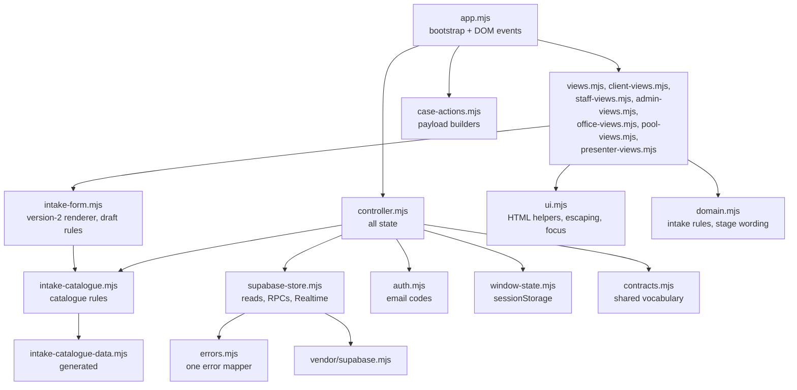

# Front end

The browser app is plain JavaScript ES modules with no framework, no bundler and no build step.
`index.html` loads [`src/app.mjs`](../../src/app.mjs) as a module, and the browser fetches the rest
of `src/` directly. The only third-party code is the Supabase SDK, committed as a pinned bundle in
[`src/vendor/supabase.mjs`](../../src/vendor/supabase.mjs).

The front end **predicts** what a person may do so it can show the right buttons, but the
[database](database.md#the-action-api) decides. Never move a rule into the browser alone.

## Contents

- [Module map](#module-map)
- [Boot sequence](#boot-sequence)
- [The controller](#the-controller)
- [Screens](#screens)
- [Rendering](#rendering)
- [The version-2 intake form](#the-version-2-intake-form)
- [Events and actions](#events-and-actions)
- [Errors, conflicts and retries](#errors-conflicts-and-retries)
- [Live updates](#live-updates)
- [Sign-in](#sign-in)
- [Window state](#window-state)
- [Styling and accessibility](#styling-and-accessibility)
- [Testing](#testing)
- [Recipes](#recipes)
- [Moving to a framework](#moving-to-a-framework)

## Module map


```mermaid
flowchart TD
  app["app.mjs<br/>bootstrap + DOM events"] --> controller["controller.mjs<br/>all state"]
  app --> views["views.mjs, client-views.mjs,<br/>staff-views.mjs, admin-views.mjs,<br/>office-views.mjs, pool-views.mjs,<br/>presenter-views.mjs"]
  app --> caseActions["case-actions.mjs<br/>payload builders"]
  views --> intakeForm["intake-form.mjs<br/>version-2 renderer, draft rules"]
  intakeForm --> catalogue["intake-catalogue.mjs<br/>catalogue rules"]
  controller --> catalogue
  catalogue --> catalogueData["intake-catalogue-data.mjs<br/>generated"]
  controller --> store["supabase-store.mjs<br/>reads, RPCs, Realtime"]
  controller --> auth["auth.mjs<br/>email codes"]
  controller --> windowState["window-state.mjs<br/>sessionStorage"]
  views --> ui["ui.mjs<br/>HTML helpers, escaping, focus"]
  views --> domain["domain.mjs<br/>intake rules, stage wording"]
  store --> errors["errors.mjs<br/>one error mapper"]
  controller --> contracts["contracts.mjs<br/>shared vocabulary"]
  store --> sdk["vendor/supabase.mjs"]
```

Dependency rules that keep the pieces testable:

- **Views are pure.** They take state and return an HTML string. They never import the controller,
  the store or the SDK, and never touch the DOM.
- **The controller renders nothing.** It owns state and calls an injected `render()`. It receives
  `store` and `auth` as arguments, so tests run it against doubles.
- **Only the store talks to Supabase.** Only `app.mjs` imports the SDK, and only to create the
  client it hands to the store and auth modules.
- **`app.mjs` holds no state and writes no HTML.** It reads configuration, builds the modules, and
  turns DOM events into controller calls.
- **Catalogue rules live in one place.** Whether a question is visible, answered, valid or
  missing comes only from [`intake-catalogue.mjs`](../../src/intake-catalogue.mjs); the renderer
  and the draft rules come only from [`intake-form.mjs`](../../src/intake-form.mjs). Screens and
  the controller call them and never re-implement them. The database mirrors the same checks, and
  a test compares the two.

## Boot sequence

1. `app.mjs` fetches `./public-config.json` (relative, so it works under a GitHub Pages subpath).
2. If the file is missing or says `{"configured": false}`, it renders the "ViTally is not configured
   yet" screen and stops before loading the SDK.
3. Otherwise it imports the SDK bundle and creates the Supabase client with the URL and
   publishable key from the config.
4. It creates `auth` ([`auth.mjs`](../../src/auth.mjs)), `store`
   ([`supabase-store.mjs`](../../src/supabase-store.mjs)) and the controller, passing `render`,
   `window.sessionStorage` and `window` (for online/focus events).
5. The controller restores the session, reads the membership, loads the right data, subscribes
   to Realtime, and renders.

## The controller

[`src/controller.mjs`](../../src/controller.mjs) is the single source of browser state. The main
fields:

| Field | Meaning |
| --- | --- |
| `session`, `principal` | Sign-in status (`unknown`, `none`, `present`) and `{userId, workspaceId, access, email}` |
| `connection` | `online`, `reconnecting`, `offline` |
| `cases`, `people`, `assistance`, `workspace` | Lists for the current screen (people, assistance and workspace for presenters only) |
| `savedCase` | The open case exactly as the server last returned it |
| `draftAnswers`, `dirty`, `editBaseRevision`, `conflict`, `saveState` | The intake form's unsaved edits, kept apart from `savedCase` |
| `visitedSteps`, `revealed` | Version 2: the steps left at least once (their missing answers show), and the ids whose invalid value is shown ([below](#the-version-2-intake-form)) |
| `screen`, `selectedCaseId`, `selectedPersonId`, `formStep`, `openPanels`, `boardFilters`, `caseTab`, `sidebarOpen` | Window-local navigation, remembered per window |
| `boardSearchDraft` | The work board's half-typed search, kept so a redraw doesn't blank it |
| `busy`, `error`, `retryable`, `notice`, `dialog` | What the page should show right now |

Its public API is the list at the end of the file: `start`, `stop`, `getState`, `refresh`,
sign-in (`sendCode`, `verifyCode`, `editAuthEmail`, `editAuthCode`, `restartSignIn`, `signOut`,
`cooldownRemaining`), cases (`selectCase`, `createCase`, `createAssistedCase`, `editAnswers`,
`saveAnswers`, `reconcileAnswers`, `runAction`, `retryLast`), the version-2 form (`goToStep`,
`revealInvalid`, `removeMember`), assistance (`runAssistanceAction`), presenter tools
(`selectPerson`, `resetFixtures`, `loadCheckpoint`), and navigation (`navigate`, `setFormStep`,
`togglePanel`, `setBoardFilter`, `clearBoardFilters`, `setBoardSearchDraft`, `toggleSidebar`,
`setCaseTab`, `setLookup`, `openDialog`, `closeDialog`, `dismissError`).

Three rules the controller keeps:

1. **Saved and draft are different.** A live update replaces `savedCase` but never rewrites what
   someone typed. If the server's version changed under unsaved edits, `conflict` is set and saving
   is refused until the person chooses mine or theirs (`reconcileAnswers`).
2. **An unknown outcome keeps its envelope.** On `OFFLINE` or `SERVER_ERROR` the exact envelope is
   kept, and "Try again" (`retryLast`) resends it unchanged so the database replays its receipt
   instead of acting twice.
3. **Answers are whitelisted once,** by the case's version (`pickAnswers`): version 1 keeps its
   17 `INTAKE_ANSWER_KEYS` as strings; version 2 keeps the catalogue's top-level ids with their
   structured values (a `null` means "clear this field on the next save").

## Screens

`app.mjs` picks the screen from state (`screenFor`):

| Who | Screens |
| --- | --- |
| Signed out | Email and code form ([`client-views.mjs`](../../src/client-views.mjs) `accessScreen`); "cannot reach the server" and "no access" screens ([`views.mjs`](../../src/views.mjs)) |
| Applicant | `applications` (list and lookup by Application ID), `reference` (new ID to keep), `intake` (the four-step form for a version-1 case, the nine-step form for a version-2 case), `progress` (status, client number, requests, send document) |
| Presenter, volunteer persona | `staff`: the work board; `staff-case`: the case page with its tabs ([`staff-views.mjs`](../../src/staff-views.mjs)) |
| Presenter, `admin` persona | `staff`: the Follow-ups queue ([`office-views.mjs`](../../src/office-views.mjs)); `office-cases`: the case pool ([`pool-views.mjs`](../../src/pool-views.mjs)); `office-add-case`: Add a case for a walk-in client ([`office-views.mjs`](../../src/office-views.mjs)); `staff-case`: the office's case page ([`admin-views.mjs`](../../src/admin-views.mjs)) |
| Every presenter | The presenter panel on top ([`presenter-views.mjs`](../../src/presenter-views.mjs), demo only) |

`staffScreen` in [`views.mjs`](../../src/views.mjs) wraps staff screens in the app shell
(sidebar plus corner toggle). An office screen chosen while a volunteer persona is active shows
the work board instead. On `main`, Add a case is today's version-1 page and the staff case page
has no version-2 answers panel yet; part 4c adds both, with the contact and materials cards.

## Rendering

Every state change calls `render()`, which rebuilds the whole page:

```js
root.innerHTML = views.page(state, screenFor(state));
```

This is simple and makes every screen a pure function, but a full rebuild destroys the element
that had keyboard focus and any text typed into fields that are not in state. Four mechanisms
compensate, all in `app.mjs` and [`ui.mjs`](../../src/ui.mjs):

- **Focus restore.** Before rebuilding, `describeFocus` records the focused element's id, name,
  action and related row ids; afterwards `restoreField` finds the same control again. A control
  whose row disappeared gets no focus rather than another row's button.
- **Staff form drafts.** Text typed in staff forms (reasons, notes, findings) is kept in a
  `formDrafts` map by field id and put back after each rebuild. It is cleared only for the form
  that was submitted.
- **In-place patches.** The sign-in countdown and the intake save indicator update their text
  without a rebuild, so they never interrupt typing.
- **Dialogs** take focus when they open and return it to the control that opened them.

**Version-2 forms have stricter rules**, because a client can type while another window changes
the same case; they are described in [the next section](#the-version-2-intake-form).

**Escape everything.** Views build HTML strings, so every interpolated value must go through
`esc()` from `ui.mjs`. The helpers (`input`, `textarea`, `select`, `button`, `caseButton`) escape
for you; raw template literals do not.

## The version-2 intake form

The nine-step form (part 4b) is built from the catalogue by the shared renderer in
[`src/intake-form.mjs`](../../src/intake-form.mjs). The full design, with the reasons for each
rule, is in [the intake screens spec](../superpowers/specs/2026-09-30-intake-screens-design.md)
§2–§3; this section is the map.

**The renderer** is pure. `renderQuestion(question, value, { variant, lang, scope, answers,
showMissing, revealed })` returns one question's HTML. Ids are `field-<scope>-<id>` (household
sub-fields `field-<scope>-hh-<n>-<sub>`), so the same question can appear twice on a page. Every
control carries `data-q` (and `data-member`, `data-sub`, `data-date-part` where they apply) and
`data-control`; every question has a fixed note container `field-<scope>-<id>-note` that is
always rendered, so its text can change in place. `readField` and `readForm` read controls back
into answers, `formatAnswer` gives the read-only text ("Apr 12, 1961", "(215) 555-0199").

**The draft holds exactly what is in the box.** Nothing is trimmed while typing. Every check uses
the value as the server would receive it (`sendable`: trimmed text, empty household sub-fields
dropped).

- **Invalid values never reach the server.** One invalid value would make the server refuse the
  whole save, so every save sends `withholdInvalid(draft, 2)`: the draft minus any field whose
  value fails `checkValue`. The draft keeps it, and the server keeps its last valid value.
- **`dirty` means "a save would change the server"** (`sendableDiffers`), recomputed after every
  edit. Editing a withheld value or adding a trailing space leaves it false; an undo turns it
  false again, but only from Unsaved (after a failed save it stays true until a save succeeds).
- **A refresh keeps local-only differences** (`keepLocalOnly`): a withheld value, or one that
  differs from the server's only by spaces, survives a post-save or realtime refresh.
- **Errors are shown only once revealed.** An invalid value's message shows when its id is in
  `revealed`: on `change` (a date only when its step is left) and for every invalid answer when
  the person leaves a step. Typing never reveals; it only clears. Missing answers show "Needs an
  answer" once a step has been visited (`visitedSteps`). The Saved chip counts shown errors only;
  step 9's list and the Submit gate count every visible invalid answer.
- **The four contact fields** (`tp_phone`, `sp_phone`, `best_contact_time`, `best_contact_note`)
  sit in the draft beside the answers (`CONTACT_FIELDS`); the server stores them in
  `case_contacts`. Missing answers are computed from the draft alone.

**Redraw rules** (in `app.mjs`). The page is still rebuilt with `innerHTML`, so the form limits
when that may happen:

1. **A press never loses its target.** While a pointer is down on the page, every redraw, and
   every in-place update caused by `change`, waits until after the `click` (released by
   `pointerup`, `pointercancel`, `contextmenu`, `blur`, `visibilitychange` or a 2-second timer).
2. **`input` updates in place, never redraws:** the question's note, the current step's rail
   mark, a long text's character count and the Saved chip, by `className` and `textContent`
   only.
3. **A full redraw happens only when the visible questions change:** a radio, checkbox or select
   changes, or a text field that drives a show-if (today only `gcf_sp_signature`) changes and the
   `data-q` set on the page differs from `visibleIds(step, draft)` (`needsRedraw`).
4. **Other redraws keep focus, caret and scroll** when they stay in the same place (the same
   screen, case and step, compared inside `render()`). A step change scrolls to the top and
   focuses `#main`. A redraw during IME composition waits for `compositionend`.

Before a save or a step change, `sweepV2Form` reads the whole form into the draft once more (for
values that arrived without an `input` event, such as autofill); it is skipped while a redraw is
held, because the boxes may then show an older value than the draft.

## Events and actions

`app.mjs` listens once on the root for `click`, `input`, `change` and `submit` (and on the document
for `keydown`, for Escape and dialog focus), and reads data attributes:

| Attribute | Meaning | Handled by |
| --- | --- | --- |
| `data-action="open-case"` | Navigation or a UI toggle | The `runNavigation` switch in `app.mjs` |
| `data-case-action="VERIFY_DOCUMENT"` | A workflow action | `payloadFor` then `controller.runAction` |
| `data-assistance-action="CLAIM"` | An assistance item action | `controller.runAssistanceAction` |
| `data-case-id`, `data-request-id`, `data-followup-id`, `data-item-id` | Which row the control belongs to | Payload builders and focus restore |

A workflow button inside a `<form class="staff-form">` submits the form; `payloadFor(type,
button.dataset, formValues)` in [`case-actions.mjs`](../../src/case-actions.mjs) builds the payload
and refuses locally anything the database would refuse for certain (unknown type, missing required
text, missing related id). The controller then adds the envelope fields and sends it.

Field ids come from `fieldId(name, scope)`. Any control repeated per row must pass the row id as
`scope` and carry the row's `data-*-id`, so two rows never share an id.

## Errors, conflicts and retries

Every failure reaches the controller as an error with a `code` from `ERROR_CODES`
([`contracts.mjs`](../../src/contracts.mjs)), mapped once in
[`errors.mjs`](../../src/errors.mjs). The page shows a safe sentence for the code, never database
text.

| Code | What the controller does |
| --- | --- |
| `CONFLICT` | Re-reads the case, shows "Someone else changed this ...", drops the envelope |
| `OFFLINE`, `SERVER_ERROR` | Keeps the envelope, shows a notice with "Try again" |
| `FORBIDDEN`, `NOT_FOUND`, `INVALID_TRANSITION`, `SELF_REVIEW`, `INELIGIBLE`, `VALIDATION` | Shows the refusal; nothing to retry |

**Eligibility helpers** (`staffEligibility` in `staff-views.mjs`, `adminEligibility` in
`admin-views.mjs`) follow the database's check order so the page can hide unavailable buttons and
explain why ("A different volunteer has to review this case"). They are predictions; the database
answer always wins.

## Live updates

After sign-in the controller calls `store.subscribe`, which opens one Realtime channel for the
tables the principal may read (`SUBSCRIBED_TABLES`). Each event is reduced to
`{table, eventType, id, caseId}`. `handleChange` in the controller decides what may be stale and
re-reads it:

- a `cases` event: the list;
- any event about the open case (its requests, documents, history, reviews): that case;
- an `assistance_items` event: the assistance list;
- a `workspaces` event (a sample reset, or a change to the workspace row such as its intake
  version): everything, with a notice if the open case vanished.

`case_contacts` and `case_materials` events carry a case id like the other child tables, so they
re-read the open case.

Connection status (`online`, `reconnecting`, `offline`) comes from the channel and shows in the
page header and presenter panel. On reconnect, window focus and the browser's `online` event, the
controller refreshes.

## Sign-in

[`src/auth.mjs`](../../src/auth.mjs) wraps Supabase Auth email one-time codes:

- `sendCode(email)` calls `signInWithOtp` with `shouldCreateUser: false` and always shows the same
  neutral message (`NEUTRAL_SEND_MESSAGE`), whether the address is known, unknown or rate-limited.
- `verifyCode(email, code)` calls `verifyOtp`. An expired or wrong code and an unreachable server
  produce different, specific messages.
- A resend cooldown of the server's interval plus five seconds (65 by default, from
  `authResendCooldownSeconds` in the public config) is kept in session storage, so a reload does
  not reset it.

There are no passwords anywhere in the app.

## Window state

[`src/window-state.mjs`](../../src/window-state.mjs) stores per-window navigation (screen, open
case, form step, persona, board filters, case tab, whether the sidebar is open, and a version-2
case's visited steps and revealed errors) in `sessionStorage` under a key that includes the user
id. Each field has its own shape check (`FIELDS`); a malformed one is dropped, and the visited
steps are ignored unless they belong to the open case. Two windows can show different things; two accounts in one browser never share a view; signing
out clears it. It never stores codes, tokens or answers.

## Styling and accessibility

All styles are in [`src/styles.css`](../../src/styles.css). Redesigned screens use the `--vt-*`
tokens in its second `:root` block (colors only from tokens, plus `#fff`), and each part adds its
rules in its own fenced block (`/* Part 4b: intake v2 */ … /* end part 4b */`), so a part's CSS
can be reviewed and removed as a unit. The design system is
[`docs/design/DESIGN.md`](../design/DESIGN.md). The browser story test captures
screens at 720 px and 390 px wide and checks that nothing scrolls sideways.

Conventions already in place: every field has a `<label>`; dialogs keep and return focus and close
on Escape; save states, countdowns and refusals are written in text and marked `role="status"` or
`role="alert"` so screen readers announce them; keyboard focus survives live updates. The product spec asks for Chinese as well as English; there is no translation layer yet
(see the [roadmap](production-roadmap.md#6-language-and-accessibility)).

## Testing

| Suite | Command | What it tests |
| --- | --- | --- |
| Unit (429) | `npm test` | Controller against doubles, renderers as strings, payload builders, eligibility, store mapping, auth, focus logic. No browser, no network |
| Sign-in gate (20) | `npm run test:auth-browser` | Real sign-in through the real form in Chrome and Firefox against the local stack |
| Story (53) | `npm run test:browser` | The full demonstration in two browsers at once, both engine orders, plus regressions (conflicts, offline retry, privacy, keyboard) |

Run the browser suites with the `PATH` prefix from [`docs/setup.md`](../setup.md#5-tests). The
story writes screenshots to `artifacts/browser/` (git-ignored). Helpers for driving the pages are in
[`tests/support/story-pages.mjs`](../../tests/support/story-pages.mjs).

For a renderer change, add a unit test that renders the state and checks the HTML. For a
behaviour change, add a controller test with a store double. Use the story only for what needs a
real browser.

## Recipes

### Add a button for a new action

After the database side exists ([database recipe](database.md#add-a-workflow-action)):

1. Add a payload builder to `BUILDERS` in `case-actions.mjs` and a unit test for it.
2. Add a rule to `staffEligibility` (or `adminEligibility`) that says when the action is offered
   and why not otherwise, following the database's check order.
3. Render it with `caseButton(label, "NEW_ACTION", kind, extra)` or, if it needs text, a
   `<form class="staff-form">` with `caseSubmit`. Pass the related row id as a `data-*-id`
   attribute and as the `scope` of every field id.
4. Add a success message to `STAFF_NOTICES` in `app.mjs` if the action should announce itself.
5. Unit-test the rendered button for eligible and ineligible personas.

### Change the intake form

**The questions** (version 2) are data: edit the drafts in `docs/intake-questions/` and run
`npm run build:intake`, following the
[database recipe](database.md#change-the-intake-questions). The form, the read-only answers and
the checks all follow the catalogue with no screen change.

**How a question type looks or reads** is `renderQuestion` and `valuesFromControls` in
`intake-form.mjs`, with a unit test in `tests/intake-form.test.mjs` for render-then-read round
trips. **The layout** (rail, step header, sections, step 9's list, Submit) is `intakeScreenV2`
in `client-views.mjs`, which `intakeScreen` dispatches to for a version-2 case. Keep the redraw rules above: a new control that changes
which questions are visible must be a choice, or be added to the `drivesVisibility` check.

**Version 1** (the four-step form in `client-views.mjs`, with its keys in `domain.mjs`) is frozen
until it is removed; don't extend it.

### Add a screen

1. Add the screen name to `CLIENT_SCREENS` or `STAFF_SCREENS` in the controller so it can be
   navigated to and restored.
2. Write a pure renderer that takes state and returns HTML, using the `ui.mjs` helpers.
3. Route to it in `screenFor` (`app.mjs`) or `staffScreen` (`views.mjs`).
4. Add a `data-action` for getting there, handled in `runNavigation`.

## Moving to a framework

The full-page `innerHTML` rebuild is the weakest part of the front end. The focus, draft and
in-place-patch mechanisms exist only to work around it, and the story test found cases where a
click landing during a rebuild burst was lost. A component framework with DOM diffing (React,
Vue, Svelte) would remove that whole class of problem and make internationalization and component
reuse easier.

If you migrate, keep the parts that are framework-independent and already tested:

| Keep as is | Replace |
| --- | --- |
| `contracts.mjs`, `errors.mjs`, `domain.mjs`, `case-actions.mjs` | The view modules (rewrite as components) |
| `supabase-store.mjs` (the data adapter) | `app.mjs` event wiring |
| `auth.mjs`, `window-state.mjs` | Focus restore and form-draft code in `app.mjs` and `ui.mjs` |
| The controller's rules (saved vs draft, envelope retry); its state can move into a store library | The vendored SDK bundle (install `@supabase/supabase-js` normally) |

A build step also means GitHub Pages needs a build workflow, or a host that builds for you. Keep
`public-config.json` loaded at runtime, not baked in at build time, so one build can serve several
environments.
