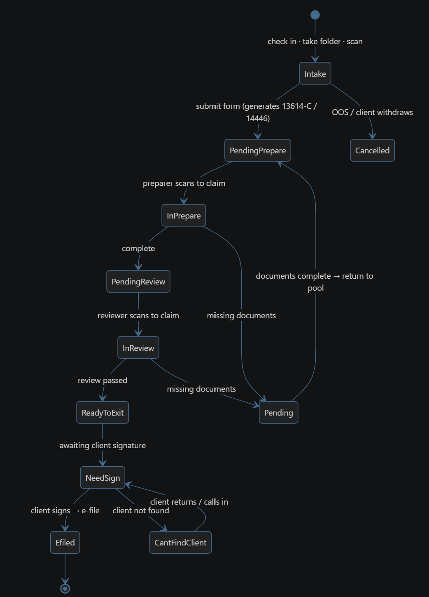

# ViTally — VITA Site Management System

**Project proposal**
**Course:** CSE 416 — Software Engineering Project
**Partner:** PCDC (Philadelphia Chinatown Development Corporation)
**Term:** Fall 2026
**Team:** Cody Chi · Hailey Zheng · Jinyu Yang · Kelvin Chiu · Manqi Lu

> Full technical detail — functional requirements, the complete state machine, and non-functional requirements — lives in [`spec.md`](spec.md). This document is the proposal: what we are building, why it is worth building, and how we plan to get there.

---

## 1. Summary

ViTally is a bilingual (English/Chinese) web application that digitizes case management for the Volunteer Income Tax Assistance (VITA) site operated by PCDC. It replaces a largely paper- and phone-based process with an online workflow that carries a tax return from client intake through preparation, quality review, and filing — giving clients, volunteers, and administrators role-appropriate visibility into every case.

PCDC is a Philadelphia nonprofit that has run a free VITA tax preparation program for its community for over ten years. It is our real-world partner, and the source of the problem research, pre-survey findings, and workflow details in this proposal.

## 2. The problem

PCDC's VITA site serves 700+ requests each season with roughly 20 active volunteers of varying availability and certification level. Cases arrive through three separate channels — same-day on-site service, weekday drop-off, and fully remote online submission — and none of them share a common tracking system.

The concrete consequences:

- **No centralized case tracking.** Status, documents, and turnaround time are not tracked across channels, and there is no unified way to match volunteers to cases by availability, certification level, or language.
- **Communication is manual and synchronous.** Coordination happens by phone call and email, which adds administrative workload and delay, and leaves taxpayers with little visibility into their own return.
- **No data-driven case management.** The site has no dedicated data role, which limits its ability to report impact and secure future IRS grants — grants that already work out to less than $10 per case.
- **Labor-intensive workflow.** Volunteers manually review physical documents and enter data, and a second certified volunteer must review every return before submission.

## 3. What users told us

Before drafting requirements we ran an informal pre-survey with people who actually use the current process. Three recurring themes emerged.

**Clients cannot see their own status.** Ms. Xu (Case #619) reported that the office hotline is never reachable, so she has to travel to the office in person just to learn what documents are missing — difficult for her, since she has trouble walking. Ms. Liu (Case #512) watched a later case get finished before hers with no explanation of why or how much longer she would wait.

**Communication does not reach people.** Mr. Li (Case #344) asked to be texted rather than called, and found that promised texts often never arrived. Eunice, site coordinator from 2022–2023, noted that staff and clients are at work at the same hours, that clients distrust voicemails from unfamiliar numbers, and that many clients cannot use Zoom or have mobility issues that make identity verification difficult.

**Case assignment is first-come-first-served, not skill-matched.** Liu Fen missed the workflow training session and had no intuitive way to see which cases were available to take; the admin team did not realize she had flexible availability until late in the season. Roger, a CPA with 20+ years of VITA experience, described picking up simple cases himself while complex ones went to newer volunteers who then had to come back to him with questions.

These accounts point at the same three gaps: self-serve status visibility for clients, case claiming that matches work to volunteer availability and skill, and communication that does not depend on synchronous phone calls.

## 4. Proposed solution

A single web application giving each role what it currently lacks:

- **Clients** get one place to submit an intake application, see real-time case status, learn what is still missing, and receive notifications — in English or Chinese.
- **Volunteers** get a visible queue of claimable cases and a clear view of the ones they are preparing or reviewing.
- **Administrators** get status across all cases, the ability to reassign preparers, and the reporting data the site currently has no way to produce.

The workflow is modeled as an explicit case state machine, from intake through e-filing, including a hold loop for missing documents, a client-unreachable loop at signature time, and two terminal states (filed, and cancelled/out-of-scope).

*Figure 1. Case status state machine. Full state and transition definitions are in [`spec.md` §8.2](spec.md).*

Every transition is attributable to a specific staff member and timestamped, supporting the audit trail the site needs for both quality review and grant reporting.

### Goals

- Reduce repeated manual paperwork for volunteers and staff.
- Give every role real-time visibility into case status.
- Reduce manual work and errors through a secure, structured database.
- Support English- and Chinese-speaking clients throughout the experience.

## 5. Users and roles

| Role | Description | Key permissions |
|---|---|---|
| Client | The taxpayer submitting documents for return preparation. | Submit an intake application; upload documents; check case status; print, correct, or withdraw an application. |
| Volunteer | A certified VITA volunteer who prepares or reviews returns. | Claim cases; communicate with clients; check status of claimed cases; prepare and/or review returns. |
| Admin | Site coordinator(s) overseeing the VITA site. | Reassign preparers; view all cases; generate reports; issue alerts; post reference materials. |

Visibility follows role: a client sees only their own case, a volunteer sees the cases they are preparing or reviewing, and admins see everything. Role definitions are expected to evolve — additional volunteer sub-roles are likely as requirements are refined.

## 6. Scope

**In scope for v1**

- Three roles with distinct permissions
- Bilingual intake form, potentially including document upload
- Auto-generation of IRS Form 13614-C and Form 14446
- A secure, structured database for client, case, and volunteer data
- Standard web application security practices for sensitive personal and tax documents
- The on-site process converted into an online, trackable status pipeline

**Out of scope for v1**

- Facial recognition for identity verification
- Direct in-app communication with accountants (Slack is the interim channel)
- A full alert system for site closures and similar notifications
- Appointment scheduling
- Integration with organizations other than PCDC

**Candidates for later versions:** in-app communication with accountants, an alert system, AI-assisted customer support, and refinements to the state machine once real workflow data exists.

## 7. Why this needs a semester

This is not a weekend script. It requires five interconnected workflows — intake, assignment, preparation, quality review, and filing — tied together for every return, plus shared data across roles, real user accounts, sensitive document handling, bilingual support, and audit logging. Each piece is tractable; the integration is what takes a semester.

The non-functional requirements carry comparable weight: bilingual support throughout, security appropriate to tax documents, auditability of every status change, and basic accessibility, since the VITA program specifically serves individuals with disabilities and limited English proficiency.

## 8. Team

| Name | Sub-team | Responsibilities |
|---|---|---|
| Hailey Zheng | Frontend | UI development; intake question design |
| Jinyu Yang | Frontend | UI development |
| Manqi Lu | Frontend | UI development; English–Chinese translation |
| Cody Chi | Backend | Server development |
| Kelvin Chiu | Backend | Database design |

A strict frontend/backend split is a workable starting point for v1, not the long-term structure; we expect it to shift as concrete feature ownership emerges.

The team meets regularly — five meetings between 9/6 and 9/16, mixing full-team sessions with focused sub-team work — and keeps a documented trail of dates, attendance, and decisions through calendar invites, Zoom minutes, and shared document history. The full log is in [`spec.md` §12](spec.md).

## 9. Progress and plan

**Done so far**

- Documented the current on-site workflow and all three service models
- Ran a pre-survey with past clients, volunteers, and site administration
- Met with the PCDC site manager on promotion, testing, and expectations
- Drafted the case state machine
- Created the GitHub repository and a running prototype

**Milestone roadmap**

| Milestone | Focus |
|---|---|
| Milestone 1 | Project proposal: problem, users, scope, team roles, and evidence of planning and collaboration. |
| Milestone 2 | Design and setup: system architecture, stack decisions, a clonable repo with CI, and a minimal running prototype. |
| Milestone 3 | *To be defined as the team progresses.* |
| Milestone 4 | *To be defined as the team progresses.* |
| Milestone 5 | *To be defined as the team progresses.* |
| Milestone 6 | *To be defined as the team progresses.* |

## 10. Open questions

Raised during planning and still undecided. They are tracked here so they are not lost.

**Intake**

- Should the intake form support document upload directly, or is that deferred to a later step?
- Do intake questions need a voice or info-icon affordance for additional guidance?
- A client record is generated once the client submits the form, even when the client turns out to be out of scope. What happens to those records, and how are they surfaced?

**Throughput during filing season**

- If the site is overwhelmed, priority should go to e-filing cases rather than collecting completed documents. That implies a faster path into the system — creating a case record directly and bypassing the full intake form. What does that path look like, and who is allowed to use it?

**Workflow details to specify**

- Email verification: when it is required, and what a client can do before it completes.
- Case claiming: how "who claimed this case" is recorded and displayed, and whether a claim can be released or reassigned.

**Features under consideration**

- Is an AI-generated case summary feasible for the volunteer portal?
- Is appointment scheduling in or out of scope?

## 11. A note on AI assistance

The underlying research — interviews, meeting notes, service-model details, and the state machine design — is the team's own work. AI assistance was used to help assemble and format this document from that original material, and in parts of the codebase.
